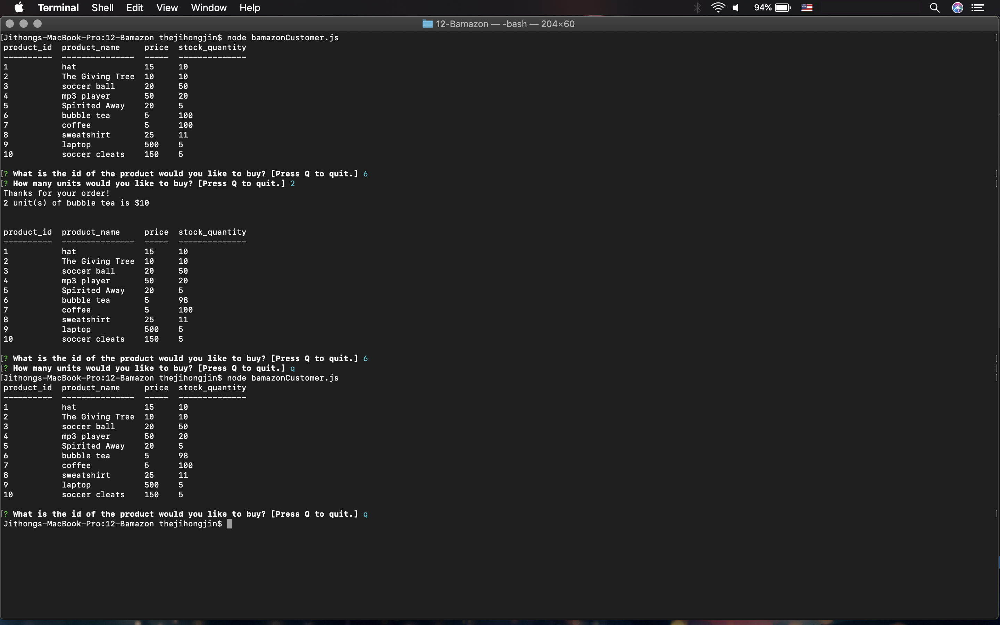
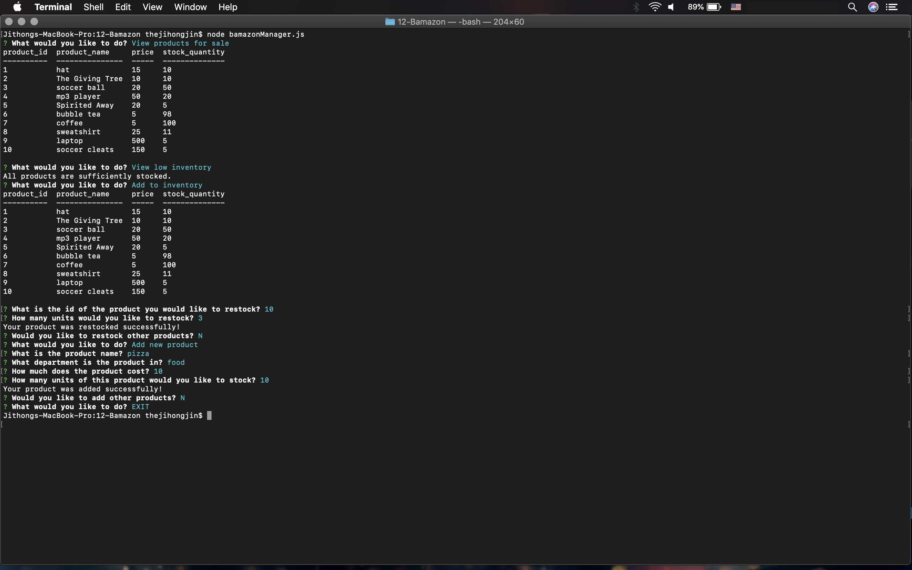
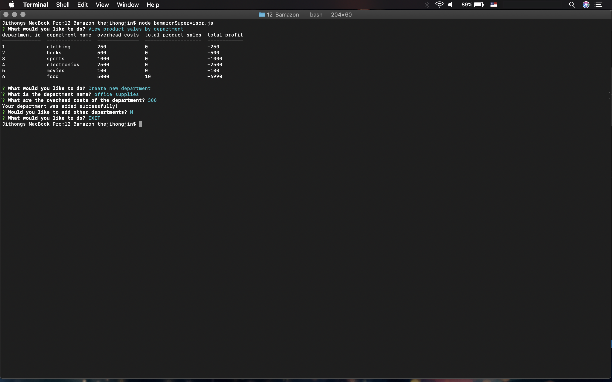

# 12-Bamazon
https://github.com/thejihongjin/12-Bamazon

# Node.js & MySQL
## Overview
Bamazon is an Amazon-like storefront app that takes in orders from customers and deplete stock from the store's inventory. The app also tracks product sales across the store's departments and then provide a summary of the highest-grossing departments in the store.

### Customer View `node bamazonCustomer.js`
* Running this application will first display all of the items available for sale.
* The app then prompts users with two messages:
   1. The first asks them the ID of the product they would like to buy.
   2. The second message asks how many units of the product they would like to buy.
* Once the customer has placed the order, the application checks if the store has enough of the product to meet the customer's request.
   * If not, the app logs a phrase `Insufficient quantity!`, and then prevents the order from going through.
   * If the store _does_ have enough of the product, the app will fulfill the customer's order and show the customer the total cost of their purchase.

### Challenge #2: Manager View `node bamazonManager.js`
* Running this application will list a set of menu options:
    * View Products for Sale   
    * View Low Inventory    
    * Add to Inventory    
    * Add New Product
* If a manager selects `View Products for Sale`, the app will list every available item.
* If a manager selects `View Low Inventory`, then it will list all items with an inventory count lower than five.
* If a manager selects `Add to Inventory`, the app will display a prompt that will let the manager "add more" of any item currently in the store.
* If a manager selects `Add New Product`, it will allow the manager to add a completely new product to the store.

### Challenge #3: Supervisor View `node bamazonSupervisor.js`
* Running this application will list a set of menu options:
   * View Product Sales by Department
   * Create New Department
* If a supervisor selects `View Product Sales by Department`, the app will display a summarized table of overhead costs, product sales, and total profit by department.
* If a supervisor selects `Create New Department`, it will allow the supervisor to add a completely new department to the store.
